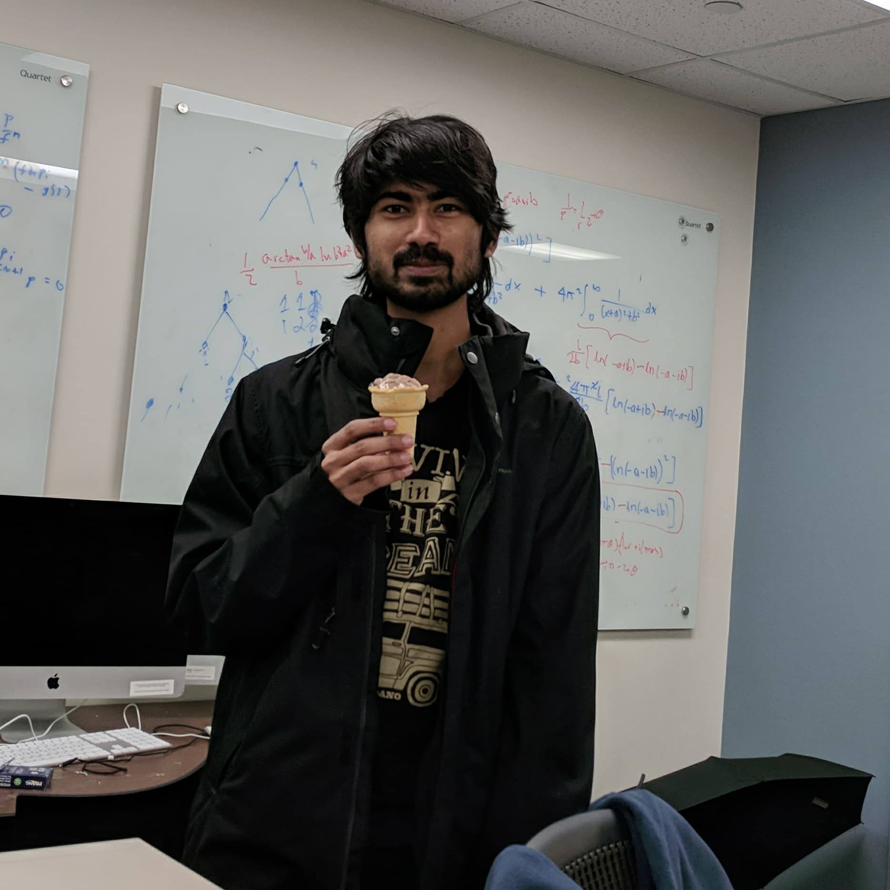

---
# You don't need to edit this file, it's empty on purpose.
# Edit theme's home layout instead if you wanna make some changes
# See: https://jekyllrb.com/docs/themes/#overriding-theme-defaults
layout: page
---

### About Me
I am a first year grad student at the [Department of Mathematics, University of Michigan](https://lsa.umich.edu/math/). I did my undergrad at the [Indian Institute of Science, Bangalore](http://www.iisc.ac.in).

### Research Interests
Math.
